# Request Lifecycle & Security Architecture

This document explains the complete lifecycle of a request through `@lenne.tech/nest-server`, covering both REST and GraphQL flows, all security mechanisms, and the interaction between CrudService and the Safety Net.

> **Audience:** Developers and AI agents building on nest-server who want to understand what features are available, how data flows, where security is enforced, and how to use or extend the framework correctly.

---

## Table of Contents

- [Features Overview](#features-overview)
- [Architecture Overview](#architecture-overview)
- [Request Flow Diagram](#request-flow-diagram)
- [Phase 1: Incoming Request](#phase-1-incoming-request)
- [Phase 2: Authorization & Validation](#phase-2-authorization--validation)
- [Phase 3: Handler Execution](#phase-3-handler-execution)
- [Phase 4: Response Processing](#phase-4-response-processing)
- [CrudService.process() Pipeline](#crudserviceprocess-pipeline)
- [Safety Net Architecture](#safety-net-architecture)
- [Decorators Reference](#decorators-reference)
- [Model System](#model-system)
- [REST vs GraphQL Differences](#rest-vs-graphql-differences)
- [Configuration Reference](#configuration-reference)
- [NestJS Documentation Links](#nestjs-documentation-links)

---

## Features Overview

`@lenne.tech/nest-server` extends NestJS with a complete application framework for GraphQL + REST APIs with MongoDB. The following sections list **all features** available out of the box.

### Core Module

The `CoreModule` is a dynamic module that bootstraps the entire framework:

| Feature | Description |
|---------|-------------|
| **GraphQL Integration** | Apollo Server with auto-schema generation (disable via `graphQl: false`) |
| **MongoDB Integration** | Mongoose ODM with automatic connection management |
| **Dual API Support** | GraphQL and REST in the same application |
| **Security Pipeline** | 4 global interceptors, global validation pipe, middleware stack |
| **Mongoose Plugins** | Auto-registration of ID, password, audit, and role guard plugins |
| **GraphQL Subscriptions** | WebSocket support with JWT/session authentication |
| **Configuration System** | `config.env.ts` with ENV variables, `NEST_SERVER_CONFIG` JSON, `NSC__*` prefixes |
| **Dual Auth Modes** | IAM-Only (BetterAuth) or Legacy+IAM for migration periods |

### Authentication & Authorization

#### BetterAuth Module (recommended)

Modern OAuth-compatible authentication with plugin architecture:

| Feature | Description |
|---------|-------------|
| **Session Management** | Secure session-based auth with automatic token rotation |
| **JWT Tokens** | Stateless API authentication (plugin) |
| **2FA / TOTP** | Two-factor authentication (plugin) |
| **Passkey / WebAuthn** | Passwordless authentication (plugin) |
| **Social Login** | OAuth providers: Google, GitHub, Apple, Discord, etc. (plugin) |
| **Email Verification** | Configurable email verification flow |
| **Sign-Up Validation** | Custom validation hooks for registration |
| **Rate Limiting** | Per-endpoint rate limits (configurable) |
| **Cross-Subdomain Cookies** | Automatic cookie domain configuration |
| **Organization / Multi-Tenant** | Teams and organization management (plugin) |
| **3 Registration Patterns** | Zero-config, config-based, or manual (`autoRegister: false`) |

#### Legacy Auth Module (backward compatible)

JWT-based authentication for existing projects:

| Feature | Description |
|---------|-------------|
| **JWT Authentication** | Bearer token auth with Passport strategies |
| **Refresh Tokens** | Automatic token renewal |
| **Sign In / Sign Up / Logout** | GraphQL mutations + REST endpoints |
| **Rate Limiting** | Configurable per-endpoint rate limits |
| **Legacy Endpoint Controls** | Disable legacy endpoints after migration (`auth.legacyEndpoints`) |
| **Migration Tracking** | `betterAuthMigrationStatus` query for monitoring |

#### Role System

| Feature | Description |
|---------|-------------|
| **Real Roles** | `ADMIN` (stored in `user.roles`) |
| **System Roles** | `S_USER`, `S_VERIFIED`, `S_CREATOR`, `S_SELF`, `S_EVERYONE`, `S_NO_ONE` (runtime-only, never stored) |
| **Method-Level Auth** | `@Roles()` decorator on resolvers/controllers |
| **Field-Level Auth** | `@Restricted()` decorator on model properties |
| **Membership Checks** | `@Restricted({ memberOf: 'teamMembers' })` |
| **Input/Output Restriction** | `@Restricted({ processType: ProcessType.INPUT })` |

### Security Features

| Feature | Description |
|---------|-------------|
| **Input Whitelisting** | `MapAndValidatePipe` strips/rejects unknown properties |
| **Input Validation** | `class-validator` integration via `@UnifiedField()` |
| **Password Hashing Plugin** | Automatic BCrypt hashing on all Mongoose write operations |
| **Role Guard Plugin** | Prevents unauthorized role escalation at database level |
| **Audit Fields Plugin** | Automatic `createdBy`/`updatedBy` tracking |
| **Response Model Interceptor** | Auto-converts plain objects to CoreModel instances |
| **Security Check Interceptor** | Calls `securityCheck()` + removes secret fields |
| **Response Filter Interceptor** | Enforces `@Restricted()` field-level access |
| **Translation Interceptor** | Applies `_translations` based on `Accept-Language` |
| **Secret Fields Removal** | Configurable fallback removal of password, tokens, etc. |
| **RequestContext** | `AsyncLocalStorage`-based context for current user in Mongoose hooks |
| **Query Complexity** | GraphQL query complexity analysis to prevent DoS |

### Data & CRUD

| Feature | Description |
|---------|-------------|
| **CrudService** | Abstract CRUD with `process()` pipeline (input/output security) |
| **Filtering** | `FilterArgs` with comparison operators (`eq`, `ne`, `gt`, `in`, `contains`, etc.) |
| **Pagination** | `PaginationArgs` with `limit`/`offset`, returns `PaginationInfo` |
| **Sorting** | `SortInput` with `ASC`/`DESC` |
| **Population** | `@GraphQLPopulate()` for automatic relation loading |
| **Field Selection** | GraphQL field selection drives Mongoose population |
| **Aggregation** | Pipeline support via CrudService |
| **Bulk Operations** | Batch create/update/delete |
| **Force Mode** | `force: true` bypasses all security checks |
| **Raw Mode** | `raw: true` skips prepareInput/prepareOutput |

### Models & Inputs

| Feature | Description |
|---------|-------------|
| **CoreModel** | Base class with `map()`, `securityCheck()`, `hasRole()` |
| **CorePersistenceModel** | Adds `id`, `createdAt`, `updatedAt`, `createdBy`, `updatedBy` |
| **CoreInput** | Base input type for validation |
| **@UnifiedField()** | Combines `@Field()`, `@ApiProperty()`, `@IsOptional()` in one decorator |
| **Nested Validation** | Recursive object/array validation via `nestedTypeRegistry` |
| **Exclude/Include** | `@UnifiedField({ exclude: true/false })` for inheritance control |

### Custom Decorators

| Decorator | Purpose |
|-----------|---------|
| `@Roles(...roles)` | Method-level authorization (includes JWT auth) |
| `@Restricted(...roles)` | Field-level access control |
| `@CurrentUser()` | Inject authenticated user (REST + GraphQL) |
| `@UnifiedField(options)` | Combined schema, validation, and API metadata |
| `@GraphQLPopulate(config)` | Mongoose populate configuration |
| `@GraphQLServiceOptions()` | Service options injection (GraphQL) |
| `@RestServiceOptions()` | Service options injection (REST) |
| `@ResponseModel(Model)` | REST response type hint for auto-conversion |
| `@Translatable()` | Multi-language field metadata |
| `@CommonError(code)` | Error code registration |

### File Handling

| Feature | Description |
|---------|-------------|
| **File Module** | Upload/download with MongoDB GridFS storage |
| **REST Endpoints** | `GET /files/:id`, `POST /files/upload`, `DELETE /files/:id` |
| **GraphQL Endpoints** | `uploadFile`, `file`, `fileByFilename`, `deleteFile` |
| **TUS Module** | Resumable uploads via tus.io protocol (creation, termination, expiration) |
| **GridFS Migration** | Completed TUS uploads auto-migrate to GridFS |
| **CORS Support** | Automatic CORS headers for browser uploads |

### Email & Templates

| Feature | Description |
|---------|-------------|
| **EmailService** | Multi-provider email sending |
| **Mailjet / Brevo** | API-based email providers |
| **SMTP** | Standard SMTP email sending |
| **TemplateService** | EJS template rendering for emails |
| **Template Inheritance** | Project templates override nest-server fallbacks |
| **Multi-Language** | Locale-aware template resolution (`template-de.ejs` → `template.ejs`) |

### Database & Migration

| Feature | Description |
|---------|-------------|
| **Mongoose Plugins** | ID handling, password hashing, audit fields, role guard |
| **Migration Module** | MongoDB migration state management with cluster locking |
| **Synchronized Migrations** | `synchronizedMigration()` with distributed locks |
| **Migration CLI** | TypeScript-based migration scripts with `getDb()` helper |
| **GridFS Helper** | Direct GridFS file access and migration utilities |

### GraphQL Features

| Feature | Description |
|---------|-------------|
| **Apollo Server** | Full GraphQL server with schema-first or code-first |
| **Custom Scalars** | `Date`, `DateTime` (timestamp), `JSON`, `Any` |
| **Subscriptions** | WebSocket support via `graphql-ws` with auth |
| **Complexity Analysis** | Query cost calculation to prevent DoS attacks |
| **Enum Registration** | `registerEnum()` helper for GraphQL enum types |
| **Upload Support** | `graphqlUploadExpress()` for multipart file uploads |

### Development & Operations

| Feature | Description |
|---------|-------------|
| **Health Check Module** | `GET /health` + GraphQL `healthCheck` query |
| **Error Code Module** | Centralized error registry with unique IDs |
| **Permissions Report** | Interactive HTML dashboard, JSON, and Markdown reports |
| **System Setup Module** | Initial admin creation for fresh deployments |
| **Cron Jobs** | `CoreCronJobsService` with timezone/UTC offset support |
| **Model Documentation** | Auto-generated model docs via `ModelDocService` |
| **SCIM Support** | SCIM filtering and query parsing utilities |

### Testing Utilities

| Feature | Description |
|---------|-------------|
| **TestHelper** | API testing helper for GraphQL and REST |
| **Cookie Support** | Session and JWT token testing |
| **Dynamic Ports** | `httpServer.listen(0)` for parallel test execution |
| **Database Cleanup** | Test data management in `afterAll` hooks |

### Configuration Patterns

| Pattern | Use Case | Example |
|---------|----------|---------|
| **Presence Implies Enabled** | Object config = enabled | `rateLimit: {}` enables with defaults |
| **Boolean Shorthand** | Simple toggle | `jwt: true` or `jwt: { expiresIn: '1h' }` |
| **Explicit Disable** | Pre-configured but off | `{ enabled: false, max: 10 }` |
| **Backward Compatible** | Undefined = disabled | No config = feature off |

### Key TypeScript Utilities

| Type | Purpose |
|------|---------|
| `IServerOptions` | Complete framework configuration interface |
| `IServiceOptions` | Service method options (`force`, `raw`, `currentUser`) |
| `PlainObject` / `PlainInput` | Type-safe plain object types |
| `ID` / `IDs` | MongoDB ObjectId or string types |
| `MaybePromise<T>` | Sync or async return type |
| `RequireOnlyOne<T>` | Require exactly one property |

---

## Architecture Overview

nest-server implements **defense-in-depth security** with three complementary layers:

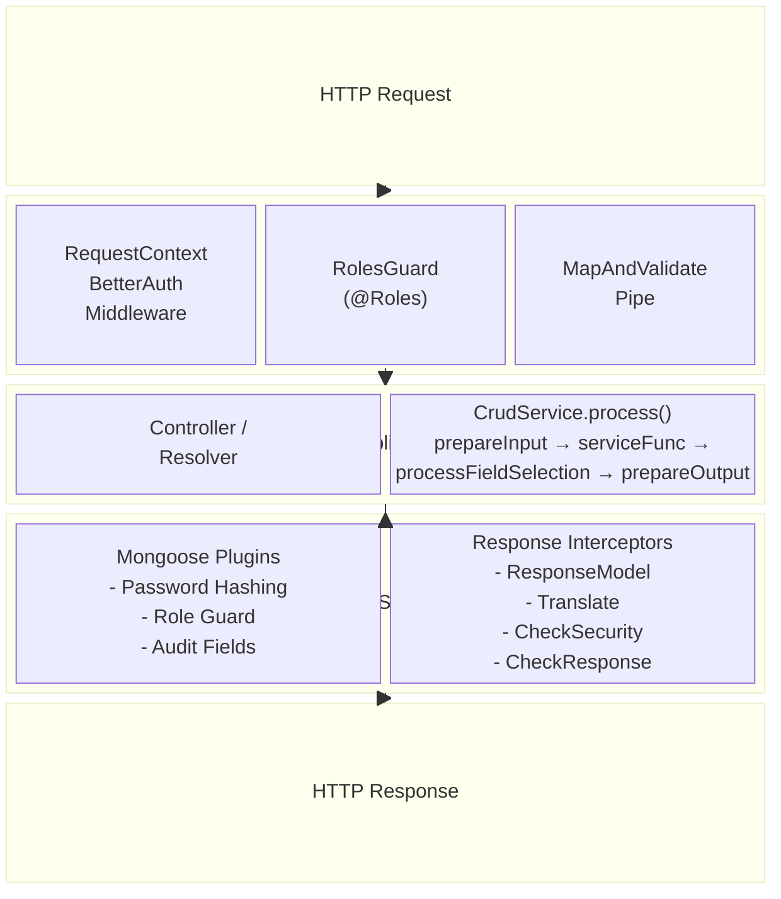

**Key principle:** Layer 2 (CrudService) provides the primary security pipeline. Layer 3 (Safety Net) catches anything that bypasses Layer 2, ensuring security even when developers use direct Mongoose queries.

---

## Request Flow Diagram

The following diagram shows the exact order of execution from HTTP request to response:

```mermaid
flowchart TD
  REQ([HTTP Request<br>REST or GraphQL])

  subgraph MW["1-3: Middleware Chain"]
    direction TB
    M1["1. RequestContextMiddleware<br><i>AsyncLocalStorage context<br>Lazy currentUser getter<br>Accept-Language</i>"]
    M2["2. CoreBetterAuthMiddleware<br><i>Strategy 1: Auth header<br>Strategy 2: JWT cookie<br>Strategy 3: Session cookie<br>→ Sets req.user</i>"]
    M3["3. graphqlUploadExpress<br><i>GraphQL only: multipart uploads</i>"]
    M1 --> M2 --> M3
  end

  subgraph GD["4: Guards"]
    G1["4. RolesGuard / BetterAuthRolesGuard<br><i>Reads @Roles metadata<br>Validates JWT / session token<br>Checks real roles (ADMIN)<br>Evaluates system roles (S_USER, ...)<br>→ 401 Unauthorized / 403 Forbidden</i>"]
  end

  subgraph PP["5: Pipes"]
    P1["5. MapAndValidatePipe<br><i>Transform → class instance<br>Whitelist: strip/reject unknown<br>Validate via class-validator<br>Inheritance-aware</i>"]
  end

  subgraph HE["6: Handler Execution"]
    direction TB
    H1["6. Controller / Resolver method<br><i>@CurrentUser injects user<br>Calls service methods</i>"]
    subgraph MG["Mongoose Plugins (on write)"]
      MP1["mongoosePasswordPlugin<br><i>Hash password</i>"]
      MP2["mongooseRoleGuardPlugin<br><i>Guard role changes</i>"]
      MP3["mongooseAuditFieldsPlugin<br><i>Set createdBy/updatedBy</i>"]
    end
    H1 --> MG
  end

  subgraph RI["7-10: Response Interceptors (reverse order)"]
    direction TB
    I1["7. ResponseModelInterceptor<br><i>Plain object → CoreModel instance<br>Resolves via @ResponseModel, @Query type, @ApiOkResponse</i>"]
    I2["8. TranslateResponseInterceptor<br><i>Apply _translations for Accept-Language<br>Early bailout when no translations</i>"]
    I3["9. CheckSecurityInterceptor<br><i>Call securityCheck on models<br>Fallback: remove secret fields</i>"]
    I4["10. CheckResponseInterceptor<br><i>Filter @Restricted fields<br>Role + membership checks</i>"]
    I1 --> I2 --> I3 --> I4
  end

  RES([HTTP Response<br>filtered & secured])

  REQ --> MW --> GD --> PP --> HE --> RI --> RES
```

---

## Phase 1: Incoming Request

### Middleware Chain

Middleware runs for **every request** before any NestJS component. Registration happens in `CoreModule.configure()`:

```typescript
// src/core.module.ts
configure(consumer: MiddlewareConsumer) {
  consumer.apply(RequestContextMiddleware).forRoutes('*');
  consumer.apply(graphqlUploadExpress()).forRoutes('graphql');
}
```

#### 1. RequestContextMiddleware

Wraps the entire request in an `AsyncLocalStorage` context, making the current user and language available anywhere — including Mongoose hooks — without dependency injection.

```typescript
// src/core/common/middleware/request-context.middleware.ts
use(req: Request, _res: Response, next: NextFunction) {
  const context: IRequestContext = {
    get currentUser() {
      return (req as any).user || undefined;   // Lazy: evaluated when accessed
    },
    get language() {
      return req.headers?.['accept-language'] || undefined;
    },
  };
  RequestContext.run(context, () => next());
}
```

**Key design:** The `currentUser` getter is **lazy**. At middleware time, `req.user` is not yet set (auth middleware hasn't run). By using a getter, the value is resolved at access time, after authentication.

#### 2. CoreBetterAuthMiddleware

Authenticates the request using three strategies in priority order:

| Priority | Strategy | Source | Token Type |
|----------|----------|--------|------------|
| 1 | Authorization header | `Bearer <token>` | JWT or Session token |
| 2 | JWT cookie | `better-auth.jwt_token` | JWT token |
| 3 | Session cookie | `better-auth.session_token` | Session token |

If authentication succeeds, `req.user` is set with the authenticated user (including `hasRole()` method).

#### 3. graphqlUploadExpress

Only for GraphQL routes. Handles multipart file upload requests according to the [GraphQL multipart request specification](https://github.com/jaydenseric/graphql-multipart-request-spec).

> **NestJS docs:** [Middleware](https://docs.nestjs.com/middleware)

---

## Phase 2: Authorization & Validation

### Guards — @Roles() Enforcement

Guards run after middleware but before the handler. The `@Roles()` decorator specifies who can access a method:

```typescript
@Query(() => User)
@Roles(RoleEnum.ADMIN)          // Only admins
async getUser(@Args('id') id: string): Promise<User> { ... }

@Mutation(() => User)
@Roles(RoleEnum.S_USER)         // Any authenticated user
async updateUser(...): Promise<User> { ... }

@Query(() => [User])
@Roles(RoleEnum.S_EVERYONE)     // Public access (no auth required)
async getPublicUsers(): Promise<User[]> { ... }
```

**Important:** `@Roles()` already handles JWT authentication internally. Do NOT add `@UseGuards(AuthGuard(JWT))` — it is redundant.

#### System Roles (S_ prefix)

System roles are evaluated at runtime and must **never** be stored in `user.roles`:

| System Role | Check Logic | Use Case |
|-------------|-------------|----------|
| `S_EVERYONE` | Always true | Public endpoints |
| `S_NO_ONE` | Always false | Permanently locked |
| `S_USER` | `currentUser` exists | Any authenticated user |
| `S_VERIFIED` | `user.verified \|\| user.emailVerified` | Email-verified users |
| `S_CREATOR` | `object.createdBy === user.id` | Creator of the resource |
| `S_SELF` | `object.id === user.id` | User accessing own data |

> **NestJS docs:** [Guards](https://docs.nestjs.com/guards), [Authorization](https://docs.nestjs.com/security/authorization)

### Pipes — Input Validation & Whitelisting

The `MapAndValidatePipe` runs on every incoming argument/body:

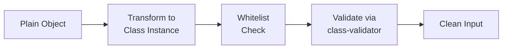

#### Whitelisting via @UnifiedField()

Properties **without** `@UnifiedField()` are subject to the whitelist policy:

| Mode | Config Value | Behavior |
|------|-------------|----------|
| **Strip** (default) | `'strip'` | Unknown properties silently removed |
| **Error** | `'error'` | Throws `400 Bad Request` with property names |
| **Disabled** | `false` | All properties accepted |

```typescript
// config.env.ts
security: {
  mapAndValidatePipe: {
    nonWhitelistedFields: 'strip',  // 'strip' | 'error' | false
  },
}
```

#### @UnifiedField() Decorator

Combines GraphQL `@Field()`, Swagger `@ApiProperty()`, and class-validator decorators into one:

```typescript
export class CreateUserInput extends CoreInput {
  @UnifiedField({ description: 'Email address' })
  email: string = undefined;

  @UnifiedField({ isOptional: true, description: 'Display name' })
  displayName?: string = undefined;

  @UnifiedField({ exclude: true })  // Hidden from schema, rejected at runtime
  internalFlag?: boolean = undefined;
}
```

> **NestJS docs:** [Pipes](https://docs.nestjs.com/pipes), [Validation](https://docs.nestjs.com/techniques/validation)

---

## Phase 3: Handler Execution

### Controllers (REST) vs Resolvers (GraphQL)

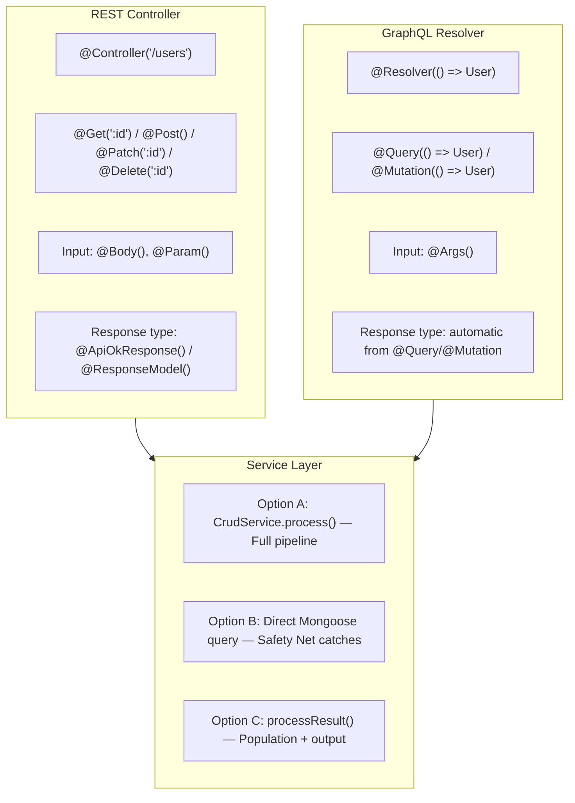

Both REST and GraphQL inject the authenticated user via `@CurrentUser()`.

### @CurrentUser() Decorator

Injects the authenticated user into the handler. This is a **custom parameter decorator** that bypasses the pipe (no validation/whitelist applied):

```typescript
@Query(() => User)
@Roles(RoleEnum.S_USER)
async getMe(
  @CurrentUser() currentUser: User,
  @GraphQLServiceOptions() serviceOptions: ServiceOptions,
): Promise<User> {
  return this.userService.get(currentUser.id, serviceOptions);
}
```

### Mongoose Plugins (Write Operations)

When the service performs write operations (save, update), Mongoose plugins fire **at the database level**:

#### Password Hashing Plugin

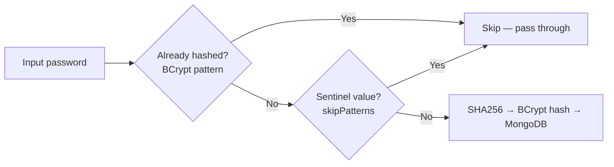

#### Role Guard Plugin

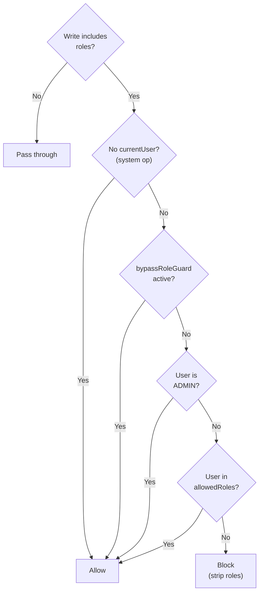

#### Audit Fields Plugin

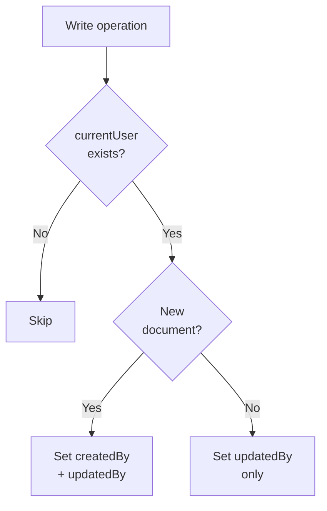

> **NestJS docs:** [Custom decorators](https://docs.nestjs.com/custom-decorators), [Mongoose](https://docs.nestjs.com/techniques/mongodb)

---

## Phase 4: Response Processing

NestJS runs interceptors in **reverse registration order** on the response. Since `ResponseModelInterceptor` is registered last in `CoreModule`, it runs **first** on the response:

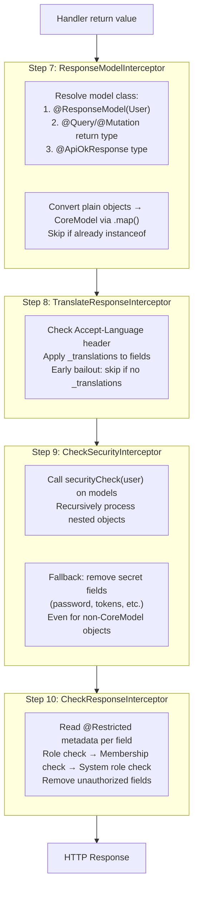

> **NestJS docs:** [Interceptors](https://docs.nestjs.com/interceptors)

---

## CrudService.process() Pipeline

The `process()` method in `ModuleService` is the **primary** way to handle CRUD operations with full security. It orchestrates input preparation, authorization, the database operation, and output preparation:

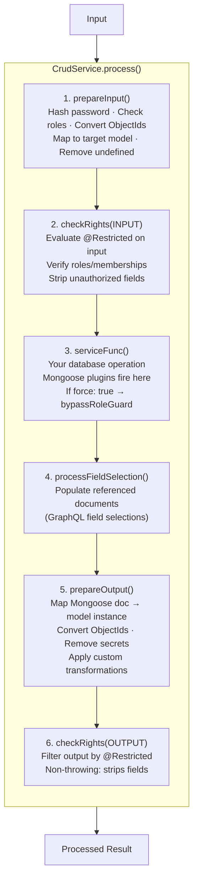

### Key Options

| Option | Type | Default | Effect |
|--------|------|---------|--------|
| `force` | boolean | `false` | Disables checkRights, checkRoles, removeSecrets, bypasses role guard plugin |
| `raw` | boolean | `false` | Disables prepareInput and prepareOutput entirely |
| `checkRights` | boolean | `true` | Enable/disable authorization checks |
| `populate` | object | - | Field selection for population |
| `currentUser` | object | from request | Override the current user |

### Alternative: processResult()

For direct Mongoose queries that need population and output preparation but not the full pipeline:

```typescript
// Direct query + simplified processing
const doc = await this.mainDbModel.findById(id).exec();
return this.processResult(doc, serviceOptions);
```

`processResult()` handles population and `prepareOutput()` only. Security is handled by the Safety Net (Mongoose plugins for input, interceptors for output).

---

## Safety Net Architecture

The Safety Net ensures security even when developers bypass `CrudService.process()` and use direct Mongoose queries. It consists of two complementary layers:

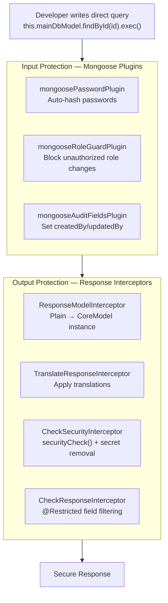

### When is process() vs Safety Net used?

| Approach | Input Security | Output Security | Population | Custom Logic |
|----------|---------------|----------------|------------|--------------|
| `process()` | prepareInput + plugins | prepareOutput + interceptors | Yes | checkRights, serviceOptions |
| Direct query + `return` | Plugins only | Interceptors only | No | None |
| Direct query + `processResult()` | Plugins only | prepareOutput + interceptors | Yes | Custom prepareOutput |

**Recommendation:** Use `process()` for full CRUD operations. Use direct queries + Safety Net for simple read-only queries, aggregations, or performance-critical paths.

---

## Decorators Reference

### @Roles() — Method-Level Authorization

Controls who can access a resolver/controller method. Evaluated by the RolesGuard.

```typescript
// Only admins
@Roles(RoleEnum.ADMIN)

// Any authenticated user
@Roles(RoleEnum.S_USER)

// Public access
@Roles(RoleEnum.S_EVERYONE)

// Multiple roles (OR logic — user needs at least one)
@Roles(RoleEnum.ADMIN, 'MANAGER')
```

**Note:** `@Roles()` includes JWT authentication. Do NOT add `@UseGuards(AuthGuard(JWT))`.

### @Restricted() — Field-Level Access Control

Controls who can see or modify specific properties. Evaluated by `CheckResponseInterceptor` (output) and `checkRights()` (input).

```typescript
export class User extends CorePersistenceModel {
  // Only admins or the user themselves can see the email
  @Restricted(RoleEnum.ADMIN, RoleEnum.S_SELF)
  email: string = undefined;

  // Only admins can see roles
  @Restricted(RoleEnum.ADMIN)
  roles: string[] = undefined;

  // Only users who are members of the 'teamMembers' array
  @Restricted({ memberOf: 'teamMembers' })
  internalNotes: string = undefined;

  // Restrict for input only (anyone can read, but only admins can write)
  @Restricted({ roles: RoleEnum.ADMIN, processType: ProcessType.INPUT })
  status: string = undefined;
}
```

### @UnifiedField() — Schema & Validation

Single decorator that replaces `@Field()`, `@ApiProperty()`, `@IsOptional()`, and more:

```typescript
export class CreateUserInput extends CoreInput {
  // Required string field (shown in both GraphQL and Swagger)
  @UnifiedField({ description: 'User email address' })
  email: string = undefined;

  // Optional field
  @UnifiedField({ isOptional: true })
  displayName?: string = undefined;

  // Enum field
  @UnifiedField({ enum: RoleEnum, isOptional: true })
  role?: RoleEnum = undefined;

  // Excluded from input (hidden from schema, rejected at runtime)
  @UnifiedField({ exclude: true })
  internalId?: string = undefined;

  // Re-include a field excluded by parent class
  @UnifiedField({ exclude: false })
  parentExcludedField?: string = undefined;
}
```

### @ResponseModel() — REST Response Type Hint

For REST controllers, specifies the model class for automatic response conversion:

```typescript
@ResponseModel(User)
@Get(':id')
async getUser(@Param('id') id: string): Promise<User> {
  return this.mainDbModel.findById(id).exec();
  // Even though this returns a Mongoose document,
  // ResponseModelInterceptor converts it to User model
}
```

**Note:** For GraphQL, the return type is resolved automatically from `@Query(() => User)`.

### @ApiOkResponse() — Swagger + Response Type

For REST controllers with Swagger. Also serves as response type hint for `ResponseModelInterceptor`:

```typescript
@ApiOkResponse({ type: User })
@Get(':id')
async getUser(@Param('id') id: string): Promise<User> { ... }
```

> **NestJS docs:** [Custom decorators](https://docs.nestjs.com/custom-decorators), [OpenAPI](https://docs.nestjs.com/openapi/introduction)

---

## Model System

### Class Hierarchy

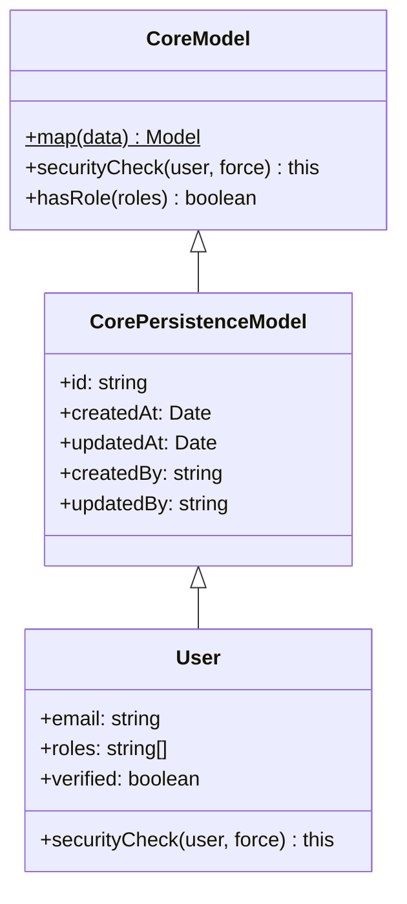

### Key Methods

#### `Model.map(data)` — Static Factory

Creates a model instance from a plain object or Mongoose document. Copies only properties that exist on the model class (defined with `= undefined`):

```typescript
const user = User.map(mongooseDoc);
// user is now a User instance with securityCheck(), hasRole(), etc.
```

This is what `prepareOutput()` and `ResponseModelInterceptor` call internally.

#### `model.securityCheck(user, force)` — Instance Security

Called by `CheckSecurityInterceptor` on every response object. Override this in your model to implement custom security logic:

```typescript
export class User extends CorePersistenceModel {
  password: string = undefined;
  internalScore: number = undefined;

  override securityCheck(user: any, force?: boolean): this {
    // Remove password from output (should never be returned)
    this.password = undefined;

    // Only admins can see internalScore
    if (!force && !user?.hasRole?.([RoleEnum.ADMIN])) {
      this.internalScore = undefined;
    }

    return this;
  }
}
```

**When securityCheck runs:**
1. `CheckSecurityInterceptor` calls it on every response object
2. `CrudService.process()` runs it via `prepareOutput()` (before the interceptor)
3. Safety Net: `ResponseModelInterceptor` converts to model first → then `CheckSecurityInterceptor` calls securityCheck

### prepareOutput() in Services

Override `prepareOutput()` in your service for custom output transformations:

```typescript
export class UserService extends CoreUserService<User> {
  override async prepareOutput(output: any, options?: any): Promise<User> {
    // Call parent (handles mapping, ObjectId conversion)
    output = await super.prepareOutput(output, options);

    // Custom transformations
    if (output && !options?.force) {
      output.fullName = `${output.firstName} ${output.lastName}`;
    }

    return output;
  }
}
```

---

## REST vs GraphQL Differences

| Aspect | REST | GraphQL |
|--------|------|---------|
| **Entry point** | `@Controller()` class | `@Resolver()` class |
| **Method decorators** | `@Get()`, `@Post()`, `@Patch()`, `@Delete()` | `@Query()`, `@Mutation()` |
| **Input** | `@Body()`, `@Param()`, `@Query()` | `@Args()` |
| **User injection** | `@CurrentUser()` (same) | `@CurrentUser()` (same) |
| **Response type resolution** | `@ResponseModel()` or `@ApiOkResponse()` | Automatic from `@Query(() => Type)` |
| **Context extraction** | `context.switchToHttp().getRequest()` | `GqlExecutionContext.create(context)` |
| **Field selection** | Not available (all fields returned) | GraphQL field selection → population |
| **File uploads** | Standard multipart | `graphqlUploadExpress()` middleware |
| **Subscriptions** | Not supported | WebSocket via `graphql-ws` |

### Guard Context Detection

Guards handle both REST and GraphQL contexts:

```typescript
// Inside RolesGuard
const gqlContext = GqlExecutionContext.create(context).getContext();
const request = gqlContext?.req || context.switchToHttp().getRequest();
```

> **NestJS docs:** [REST Controllers](https://docs.nestjs.com/controllers), [GraphQL Resolvers](https://docs.nestjs.com/graphql/resolvers)

---

## Configuration Reference

All security features are configured in `config.env.ts` under the `security` key:

### Guardian Gates

| Config Path | Type | Default | Description |
|-------------|------|---------|-------------|
| `security.checkResponseInterceptor` | `boolean \| object` | `true` | Enable @Restricted field filtering |
| `security.checkSecurityInterceptor` | `boolean \| object` | `true` | Enable securityCheck() calls |
| `security.mapAndValidatePipe` | `boolean \| object` | `true` | Enable input validation |
| `security.mapAndValidatePipe.nonWhitelistedFields` | `'strip' \| 'error' \| false` | `'strip'` | Whitelist behavior |

### Safety Net — Mongoose Plugins

| Config Path | Type | Default | Description |
|-------------|------|---------|-------------|
| `security.mongoosePasswordPlugin` | `boolean \| { skipPatterns }` | `true` | Auto password hashing |
| `security.mongooseRoleGuardPlugin` | `boolean \| { allowedRoles }` | `true` | Role escalation prevention |
| `security.mongooseAuditFieldsPlugin` | `boolean` | `true` | Auto createdBy/updatedBy |

### Safety Net — Response Interceptors

| Config Path | Type | Default | Description |
|-------------|------|---------|-------------|
| `security.responseModelInterceptor` | `boolean \| { debug }` | `true` | Plain → Model auto-conversion |
| `security.translateResponseInterceptor` | `boolean` | `true` | Auto translation application |
| `security.secretFields` | `string[]` | `['password', ...]` | Global secret field removal list |
| `security.checkSecurityInterceptor.removeSecretFields` | `boolean` | `true` | Fallback secret removal |

### Role Guard Bypass

```typescript
// Option 1: Programmatic bypass in service code
import { RequestContext } from '@lenne.tech/nest-server';

await RequestContext.runWithBypassRoleGuard(async () => {
  await this.mainDbModel.create({ roles: ['EMPLOYEE'] });
});

// Option 2: CrudService force mode
this.process(serviceFunc, { serviceOptions, force: true });

// Option 3: Config-based (permanently allow roles)
security: {
  mongooseRoleGuardPlugin: { allowedRoles: ['HR_MANAGER'] },
}
```

---

## NestJS Documentation Links

| Topic | URL |
|-------|-----|
| **Request Lifecycle** | https://docs.nestjs.com/faq/request-lifecycle |
| **Middleware** | https://docs.nestjs.com/middleware |
| **Guards** | https://docs.nestjs.com/guards |
| **Interceptors** | https://docs.nestjs.com/interceptors |
| **Pipes** | https://docs.nestjs.com/pipes |
| **Custom Decorators** | https://docs.nestjs.com/custom-decorators |
| **Validation** | https://docs.nestjs.com/techniques/validation |
| **Authentication** | https://docs.nestjs.com/security/authentication |
| **Authorization** | https://docs.nestjs.com/security/authorization |
| **MongoDB / Mongoose** | https://docs.nestjs.com/techniques/mongodb |
| **GraphQL** | https://docs.nestjs.com/graphql/quick-start |
| **GraphQL Resolvers** | https://docs.nestjs.com/graphql/resolvers |
| **REST Controllers** | https://docs.nestjs.com/controllers |
| **OpenAPI / Swagger** | https://docs.nestjs.com/openapi/introduction |
| **Dynamic Modules** | https://docs.nestjs.com/fundamentals/dynamic-modules |
